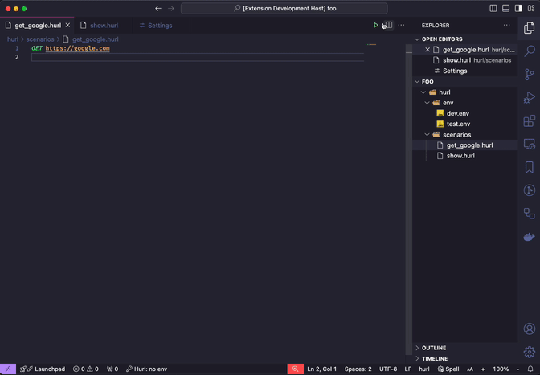
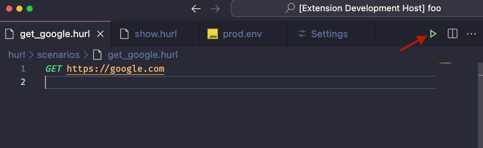
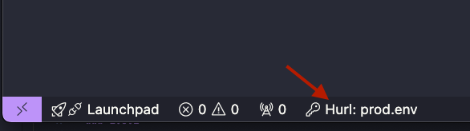
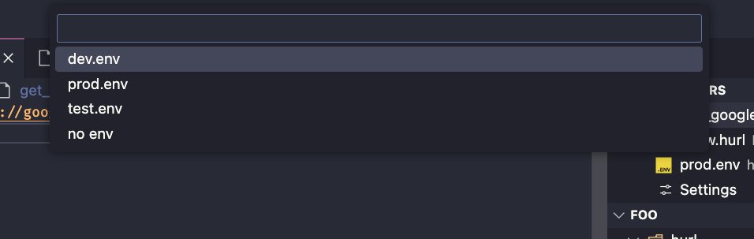
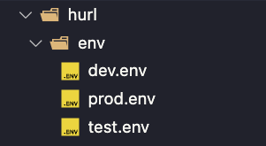

# hurl-runner

Hurl Runner makes it easy to run [hurl](https://hurl.dev/) files through VSCode.

## Features

Hurl Runner adds a handy button that executes the current Hurl file.

It adds an environment management system similar to Postman.
The current env is displayed at the bottom as a status bar item.

You can change the current env by clicking on it.

By default environment files are looked for under `./hurl/env` in your workspace.
You can change it in extension settings.

Hurl Runner will pass the currently active environment file to hurl using the [--variables-file](https://hurl.dev/docs/manual.html#variables-file) option.

## Requirements

[Hurl](https://hurl.dev/) has to be installed on your system for the extension to work properly.
